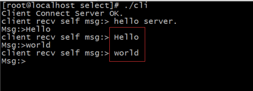

- [一、Linux I/O多路复用](#一linux-io多路复用)
- [二、select()模式](#二select模式)
- [三、select()机制分析](#三select机制分析)
- [四、I/O复用的本质](#四io复用的本质)
- [五、代码实现](#五代码实现)
  - [5.1、utili.h](#51utilih)
  - [5.2、ser.c](#52serc)
  - [5.3、cli.c](#53clic)
  - [5.4、运行结果](#54运行结果)

## 一、Linux I/O多路复用

之前：我们的处理是，每到来一个客户端，都为其开辟一个新的进/线程，对其进行一对一的服务，这是VIP的模式；在高并发情况下，将造成资源消耗过大。

现在，对应高并发：一个线程为多个客户服务；

**同一个时刻，只能为一个客户服务(作用排队);**

模型分析

<div align=center></div>

此时就会产生select()、poll()、epoll()模式

## 二、select()模式

API函数：

```cpp
  int select(int nfds, fd_set *readfds, fd_set *writefds, fd_set *exceptfds, struct timeval *timeout);
```

参数分析：nfds+1，在其后的读、写、异常、超时找模式运行；

要用到的函数：

<div align=center></div>

## 三、select()机制分析

1. **recv、send、select......都是阻塞函数；但是在这里用阻塞函数--->解决非阻塞问题；**
2. **当可读事件发生时，区别两种情况：**
   - **请求与服务器的连接；**
   - **已经连接好了，直接进行通信；**
3. **每次都要重置，只留下一个客户端即可。**
4. **select()是轮询模式，走访所有的套接字；时间设置为0，不阻塞，直接返回。**

## 四、I/O复用的本质

**对其返回值(select().....)需要特别注意，<==>按不同的情况进行处理；**

**I/O复用只关心：服务器在跟哪个客户打交道；**

## 五、代码实现

### 5.1、utili.h

```cpp
#include<unistd.h>
#include<stdio.h>
#include<string.h>
#include<stdlib.h>
#include<sys/socket.h>
#include<arpa/inet.h>
#include<netinet/in.h>
#include<assert.h>

#include<sys/select.h>

#define SERVER_IP "127.0.0.1"
#define SERVER_PORT  8787
#define LISTEN_QUEUE 5
#define SIZE 10
#define BUFFER_SIZE 256
```

### 5.2、ser.c

```cpp
#include"../utili.h"

typedef struct server_context_st{
    int cli_cnt; //有多少个客户端
    int clifds[SIZE]; //客户端套接字集合
    fd_set allfds; //套接字集合
    int maxfd;     //套接字中最大的一个
}server_context_st;

static server_context_st *s_srv_ctx = NULL;

static void server_uninit(){
    if(s_srv_ctx){
        free(s_srv_ctx);
        s_srv_ctx = NULL;
    }   
}
static void server_init(){
    int i;
    s_srv_ctx = (server_context_st*)malloc(sizeof(server_context_st));
    assert(s_srv_ctx != NULL);
    memset(s_srv_ctx, 0, sizeof(server_context_st));
    for(i=0; i<SIZE; ++i){
        s_srv_ctx->clifds[i] = -1; 
    }   
}
static int create_server_proc(const char *ip, int port){
    printf("ip>%s\n",ip);
    printf("port:>%d\n",port);
    int fd = socket(AF_INET, SOCK_STREAM, 0);
    struct sockaddr_in addrSer;
    addrSer.sin_family = AF_INET;
    addrSer.sin_port = htons(port);
    addrSer.sin_addr.s_addr = inet_addr(ip);
    socklen_t len = sizeof(struct sockaddr);

    int yes = 1;
    setsockopt(fd, SOL_SOCKET, SO_REUSEADDR, &yes, sizeof(int));

    bind(fd, (struct sockaddr*)&addrSer, len);
    listen(fd, LISTEN_QUEUE);
    return fd;
}

static int accept_client_proc(int srvfd){
    struct sockaddr_in cliaddr;
    socklen_t len = sizeof(struct sockaddr);
    int clifd = accept(srvfd, (struct sockaddr*)&cliaddr, &len);

    printf("Server Accept Client Connect OK.\n");
    int i;
    for(i=0; i<SIZE; ++i){
        if(s_srv_ctx->clifds[i] == -1){
            s_srv_ctx->clifds[i] = clifd;
            s_srv_ctx->cli_cnt++;
            break;
        }
    }

    if(i == SIZE){
        printf("too many client.\n");
    }
}

static void handle_client_msg(int fd, char *buf){
    printf("recv buffer :>%s\n",buf);
    send(fd, buf, strlen(buf)+1, 0);
}

static void recv_client_msg(fd_set *readfds){
    int clifd;
    char buffer[BUFFER_SIZE];
    int i;

    for(i=0; i<=s_srv_ctx->cli_cnt; ++i){
        clifd = s_srv_ctx->clifds[i];
        if(clifd < 0){
            continue;
        }   
        if(FD_ISSET(clifd, readfds)){
            recv(clifd, buffer, BUFFER_SIZE, 0);
            handle_client_msg(clifd, buffer);
        }
    }
}

static void handle_client_proc(int srvfd){
    int clifd = -1;
    fd_set *readfds = &s_srv_ctx->allfds;

    int retval;

    int i;
    struct timeval tv;
    while(1){
        FD_ZERO(readfds);
        FD_SET(srvfd, readfds);
        s_srv_ctx->maxfd = srvfd;
        for(i=0; i<s_srv_ctx->cli_cnt; ++i){
            clifd = s_srv_ctx->clifds[i];
            FD_SET(clifd, readfds);
            s_srv_ctx->maxfd = (clifd > s_srv_ctx->maxfd ? clifd : s_srv_ctx->maxfd);
        }     
        //retval  =select(maxfd+1, NULL, NULL, readfds)

        tv.tv_sec = 0;
        tv.tv_usec = 0;
        retval = select(s_srv_ctx->maxfd+1, readfds, NULL, NULL, &tv);
        if(retval == -1){   //错误返回
            perror("select");
            return ;
        }
        if(retval == 0){   //处理超时
            printf("Server Wait Time Out.\n");
            continue;
        }

        if(FD_ISSET(srvfd, readfds)){
            accept_client_proc(srvfd); //处理客户端的连接
        }else{
            recv_client_msg(readfds); //服务器接收客户端的消息
        }

    }
}
int main(int argc, char *argv[]){
    server_init();
    int srvfd = create_server_proc(SERVER_IP, SERVER_PORT);
    handle_client_proc(srvfd);
    return 0;
}
```

### 5.3、cli.c

```cpp
#include"../utili.h"

static void handle_connection(int sockfd){
    fd_set readfds;
    int retval = 0;
    char buffer[BUFFER_SIZE];
    int maxfd;
    while(1){
        FD_ZERO(&readfds);
        FD_SET(sockfd, &readfds);
        maxfd = sockfd;

        retval = select(maxfd+1, &readfds, NULL, NULL, NULL);
        if(retval == -1){
            perror("select");
            return;
        }   

        if(FD_ISSET(sockfd, &readfds)){
            recv(sockfd, buffer, BUFFER_SIZE, 0); 
            printf("client recv self msg:> %s\n",buffer);
            //sleep(1);
            printf("Msg:>");
            scanf("%s",buffer);
            send(sockfd, buffer, strlen(buffer)+1, 0); 
        }   
    }   
}

int main(int argc, char *argv[]){
    int sockfd = socket(AF_INET, SOCK_STREAM, 0);
    struct sockaddr_in addrSer;
    addrSer.sin_family = AF_INET;
    addrSer.sin_port = htons(SERVER_PORT);
    addrSer.sin_addr.s_addr = inet_addr(SERVER_IP);
    int retval = connect(sockfd, (struct sockaddr*)&addrSer, sizeof(struct sockaddr));
    if(retval == -1){
        perror("connect");
        return -1;
    }else{
        printf("Client Connect Server OK.\n");
    }

    send(sockfd, "hello server.", strlen("hello server")+1, 0);
    handle_connection(sockfd);
    return 0;
}
```

### 5.4、运行结果

服务器端：一直在等待客户端的连接，比较快，图不好截取；

客户端1：

<div align=center></div>

客户端2：

<div align=center></div>
