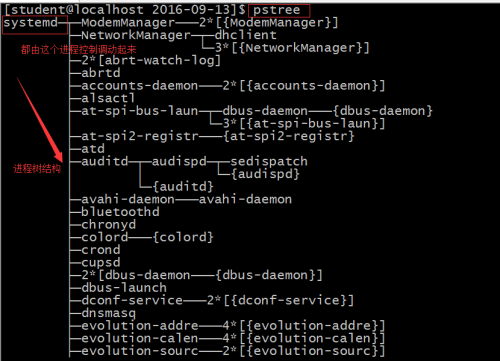
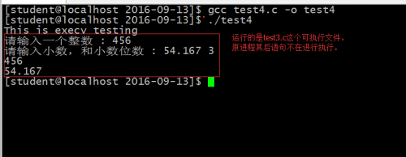

- [一、进程是什么](#一进程是什么)
- [二、进程管理块儿](#二进程管理块儿)
- [三、Linux进程的关系](#三linux进程的关系)
- [四、创建进程](#四创建进程)
  - [4.1、execv函数族](#41execv函数族)
  - [4.2、fork函数族](#42fork函数族)
- [五、execv函数](#五execv函数)
- [六、fork函数](#六fork函数)
- [七、进程的多样性](#七进程的多样性)
- [八、Copy On Write](#八copy-on-write)
- [九、一个程序引发的问题](#九一个程序引发的问题)
- [十、进程的消亡](#十进程的消亡)
- [十一、进程的通性](#十一进程的通性)

## 一、进程是什么

正在运行的程序，就是进程，进程是动态的，程序是静态的；进程在执行过程中具有状态的变化。

进程具有三个不同的状态 : 运行、就绪、阻塞;

三模型分析：

<div align=center></div>

查看进程的命令ps -ef 和 top,   kill PID(杀死进程)

- 运行态：进程获得CPU资源，能够使用CPU计算机程序中的指令，当CPU的使用时间用完时，则进入就绪状态；
- 就绪态：其它资源已经就绪，只差CPU资源；
- 阻塞态：处理CPU之外的其它资源还未就绪；

进程的调度：进程启动时处于就绪状态，为了调度进程对CPU的使用，给出了进程的优先级，现代操作系统的优先级是由一些主要参数动态变化的。

## 二、进程管理块儿

PCB是操作系统为了能够方便管理所有进程而抽象出来的一个信息集合。

PCB保存的主要信息：

<div align=center></div>

## 三、Linux进程的关系

Linux下，整个操作系统为方便管理所有进程，于是将所有的进程组织在一起，构成具有上下级关系的进程树，那么**在这个进程树下，除了根进程以外，其它进程都有父进程。**

**也就是所有的进程的进程管理块儿组织成了一个庞大的树状存储，任何一个进程管理块儿信息都是这个数的一个结点。**

使用pstree命令就可以查看当前系统的进程树 :

<div align=center></div>

## 四、创建进程

进程的创建由2个系统函数族完成。

### 4.1、execv函数族

```cpp
int execl(const char *path, const char *arg, ...);
int execlp(const char *file, const char *arg, ...);
int execle(const char *path, const char *arg,
                  ..., char * const envp[]);
int execv(const char *path, char *const argv[]);
int execvp(const char *file, char *const argv[]);
int execvpe(const char *file, char *const argv[],
                   char *const envp[]);
```

### 4.2、fork函数族

```cpp
 pid_t fork(void);
```

## 五、execv函数

execv函数的作用：**将文件系统上的一个文件加载到内存，然后将其执行。**

```cpp
int execv(const char *path, char *const argv[]); //可执行文件的路径，NULL
```

例：

```cpp
#include<stdio.h>
#include<unistd.h>
int main(void){        
    printf("This is execv testing \n");        
    execv("./test3", NULL); //test3是一个可执行文件，转而执行test3文件，原进程其后语句将不再执行。        printf("meeting execv after\n"); //这条语句并没有执行，因为在execv函数之后。        return 0;} 
}
```

运行结果：

<div align=center></div>

</br>

1. **execv函数运行一个文件时，将原先进程整个都替换掉了，转而执行那个文件的进程，原先进程其后语句将不再执行。**
2. **execv函数的主要作用 : 将外存(文件系统中)以进程方式加载一个可执行文件到内存，将会刷新调用execv函数当前进程的PCB，将大部分内容重建，保留少部分内容(进程ID，进程关系)。**
3. **execv函数并不能使得系统中的进程数量增加。**

## 六、fork函数

fork函数 : 调用fork函数的进程将根据当前进程的内容复制得到一个子进程，那么当前进程就会成为新进程的父进程，新进程的内容与父进程的内容几乎一致。

fork就是进程的分身之术。

子进程将会根据父进程拷贝得到一份完全一样的进程内容(数据段、代码段、堆栈段、寄存器状态、PCB中的大部分内容)，但是有些内容依然是不一样的(进程ID、进程关系)。

对pid = fork()这条语句的理解 :

1. fork()函数---------->创建进程
2. 返回值有2个，将共享其后的所有代码；子进程的pid的值 : 标记成功与否，0成功，非0失败；父进程的pid的值 : 是子进程的PID号。
3. 子进程/父进程谁先运行，公平竞争，不一定。

4. 创建失败，子进程的pid的值 : -1；父进程pid的值 : 错误原因的编号。
5. 一定要看清当前进程是谁? 子进程/父进程。
6. 有两个得到进程pid的方法,getpid()和getppid();得到当前进程和当前父进程的pid；

此时有可能得到如下语句:

```cpp
pid = fork();  //2个进程
fork();   //4个进程
```

上述语句将会产生4个进程，创建进程成功的情况下，总进程个数为2^N个，由于进程间是高度独立的且是封闭的，所以之间的数据并不是共享的。

产生进程的模型如下 :

<div align=center></div>

一个简单的创建进程：

```cpp
#include<stdio.h>
#include<unistd.h>

int main(void){
    pid_t pid;

    pid = fork();
    if(pid > 0){
            printf("This is father\n");
    }else if(pid == 0){
            printf("This is child\n");
    }else{
            perror("");
            return -1;
    }

    return 0;
}
```

运行结果：

<div align=center></div>

</br>

父进程先于子进程结束，但是所有的进程都会执行，当所有的进程都执行完，才结束这个程序。

模型分析：

<div align=center></div>

虽然子进程是父进程的一个完全拷贝，但是可以判定fork的返回值的不同，从一定的程度上避免子进程和父进程执行完全相同的内容。

fork得到的子进程与父进程内容是一样的，但是进程是高度独立的，所以他们之间的数据并没有共享(整体逻辑上看的)。

每个进程所能进行的内部的内存操作都是站在虚拟内存基础上的，一个进程在没有特殊手段的前提下，它只能看到自身，而看不到其他进程的存在，进程是"自大的",因为虚拟内存的存在，进程以为自己所能访问的内存大小是2的地址总线数次方(整个计算机的内存都是该进程的)。

## 七、进程的多样性

知道execv和fork之后，单单使用execv/fork都没有办法直接满足操作系统的多样化的任务需求。

此时就得将execv和fork结合使用。

```cpp
pid_t pid = fork();
if(pid == 0){
    execv("", NULL); //子进程执行execv所指定的可执行文件,执行其他进程，其后语句都被替换。
}else if(pid > 0){
                     //父进程执行本进程。
}elses{
    perror("");
}
```

通过分身+替换之术达到系统多进程的多样性。

从这个角度讲：

1. fork所承担的任务是创建一个新进程；
2. execv函数所承担的责任是替换(实现新进程执行不同的内容---从二进制可执行文件中来的内容)。

Linux系统启动为什么是一个树状结构?

**Linux启动过程中，只有第一个启动的进程(init/systemd进程)不是fork产生的，其他的进程都是通过fork和execv连用而产生的，由此就能够构建出一个完整的进程树。**

## 八、Copy On Write

通过fork和execv可以实现进程的多样性，存在一个问题?

假如当前进程所占用的内容很大，那么通过fork产生子进程时就会有巨大的浪费；fork得到的子进程会和当前进程一样的庞大，但是子进程要是不领情(它不需要父进程的遗产)，而是调execv时，将会对整个子进程的内容全部修改刷新，从父进程复制得到的内容全部都无效。

为了对齐进行有效优化，于是对fork将进行了调整。

1. 当调用fork产生子进程时，最主要的是先创建PCB，将可以复制的PCB进行复制；
2. 得到的子进程PCB，并为其分配了物理地址之后，并不会立即将父进程的内容复制给子进程；
3. 而是进行了指向引用(子进程的代码段的内容直接指向父进程的代码段，子进程的数据段的内容在一开始也是指向了父进程的数据段内容，堆段亦是如此)；
4. Copy On Write技术：如果子进程或父进程要修改数据段或堆段的内容，则立即将要修改的部分的内存拷贝给子进程，然后才可以修改。从而在逻辑上保证了进程的独立性与封闭性。

经过上面4个步骤的调整，fork完成之后不会消耗过大的CPU与内存资源。这个技术的实现关键就是进程的虚拟地址与计算机的物理地址的映射关系的管理。

这个时候就不会因为调用了fork在调用execv而产生巨大的浪费。

## 九、一个程序引发的问题

```cpp
#include<stdio.h>
#include<stdlib.h>
#include<unistd.h>
#include<sys/types.h>

int main(void){
    pid_t pid;
    int i;

    for(i = 0; i < 5; i++){
        pid = fork();
        if(pid == 0){
            printf("This is child\n");
        }

    }
    return 0;
}
```

这个的运行结果：**This is child将打印80次句话。**

> 第一个问题 : 多余的重复I/O输出

**I/O输出的时候，存在一个I/O缓冲(特殊的内存区域)，只有当缓冲区内容完全输出到I/O设备上之后，才会释放缓冲区内容(清空缓冲区)。**

I/O设备相对于CPU与内存是低速设备，这就是需要缓冲区的原因(防止低速设备降低高速设备性能)，这就会使得如果缓冲区不能够及时释放，则会使其在fork的时候复制给子进程。于是子进程会将该缓冲区的内容重复向I/O设备输出。

这就是看到的重复打印的原因。

缓冲区具有大小。

这个问题的解决需要研究设备的缓冲方式，在Linux下的设备的缓冲方式有三种：

1. 全缓冲方式：对I/O的输出直接先写入缓冲区，不到达设备，直到缓冲区全部占满为止，才会一次性释放整个缓冲区空间，将数据送到I/O设备。
2. 行缓冲方式：对I/O的输出直接先写入缓冲区，不到达设备，直到遇见新的数据为回车换行符或缓冲区满为止，将数据送到I/O设备，释放整个缓冲区空间或回车换行符之前的内容。
3. 不缓冲：缓冲区大小为0，数据直接送到I/O设备。

**setbuf()方法族可以调整缓冲区大小。**

**fflush()及时释放(清空)缓冲区。**

对上面代码的更改，清除缓冲区：

```cpp
#include<stdio.h>
#include<stdlib.h>
#include<unistd.h>
#include<sys/types.h>

int main(void){
    pid_t pid;
    int i;

    for(i = 0; i < 5; i++){
        pid = fork();
        if(pid == 0){
            printf("This is child\n");
            fflush(stdout);  //将缓冲区的内容清空。
        }

    }
    return 0;
}
```

此时输出的结果：**This is child 打印31次，是正确的结果。**

> 第二个问题: 产生了多少个进程(包括一开始的那个父进程)

一共产生了2的循环次数方的进程。原因在于所产生的每一个子进程都会继续调用fork。这就是进程×××。(fork资源不可用)

## 十、进程的消亡

**进程的消亡：通过系统调用exit来结束进程。虽然程序中可以不写exit方法，但是只要是进程结束都是通过exit来结束，即便是main方法执行结束，最终还是exit。**

进程的消亡过程：进程通过调用exit告知操作系统内核将要结束。这是因为PCB的管理权是操作系统内核的，操作系统内核需要知道进程的结束，以便：

- 告知该进程的父进程"你的子进程要结束了"；
- 回收PCB资源。

## 十一、进程的通性  

1. 需要PCB对其进行管理；
2. 进程是自大的；
3. 进程是独立的，高度封闭的；
4. 没有任何一个进程是独立于进程树而存在的。
