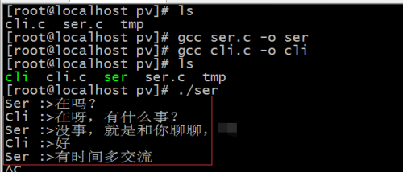

- [一、P-V操作原理](#一p-v操作原理)
- [二、P-V操作的实现](#二p-v操作的实现)

## 一、P-V操作原理

P-V操作利用信号量的阻塞，也相当于一种锁机制。

P操作和V操作是不可中断的程序段，称为原语。

P原语操作的动作：

1. sem减1；
2. 若sem减1后仍大于或等于0，则进程继续执行；
3. 若sem减1后小于0，则该进程被阻塞后进入与该信号相对应的队列中，然后转进程调度。

V原语操作的动作：

1. sem加1；
2. 若相加结果大于0，则进程继续执行；
3. 若相加结果小于或等于0，则从该信号的等待队列中唤醒一等待进程，然后转进程调度。

**注意：P、V操作对于每一个进程来说，都只能进行一次，而且必须是成对使用，且在P、V原语执行期间不允许有中断发生。**

## 二、P-V操作的实现

思路：根据共享内存和信号量的知识，进行P、V操作的实现，目的：实现服务器端和客户端一问一答的对话模式？

1、服务器端代码：

```cpp
#include<stdio.h>
#include<unistd.h>
#include<sys/ipc.h>
#include<sys/sem.h>
#include<sys/shm.h>

union semun{
    int val;
    struct semid_ds *buf;
    unsigned short *array;
    struct seminfo *__buf;
};

int main(void){

    key_t shm_key = ftok("tmp", 7); 
    if(shm_key == -1){
        perror("ftok shm");
        return -1; 
    }   
    int shmid = shmget(shm_key, 1024, IPC_CREAT | IPC_EXCL | 0755);
    if(shmid == -1){
        perror("shmget");
        return -1; 
    }   
    char *ch = (char *)shmat(shmid, NULL, 0); 
    if(ch == (void *)-1){
        perror("shmat");
        return -1;
    }

    key_t sem_key;
    sem_key = ftok("tmp", 2);
    int semid = semget(sem_key, 2, IPC_CREAT | IPC_EXCL | 0755); //申请2个共享资源
    if(semid == -1){
        perror("semget");
        shmdt(ch);
        shmctl(shmid, IPC_RMID, 0);
        return -1;
    }

    union semun init;
    init.val = 0;
    semctl(semid, 0, SETVAL, init);  //初始化信号量，下标为0的初始化为0个
    semctl(semid, 1, SETVAL, init);  //下标为1的初始化为0个 
    struct sembuf p = {0, -1, 0};
    struct sembuf v = {1, 1, 0};

    while(1){
        printf("Ser :>");
        scanf("%s", ch);
        if(strncmp(ch, "quit", 4) == 0){
            shmdt(ch);   
           break;
        }
        semop(semid, &v, 1);

        semop(semid, &p, 1);
        printf("Cli :>%s\n", ch);
    }

    int res = shmctl(shmid, IPC_RMID, 0);
    if(res == -1){
        printf("Remove shm Fail\n");
        return -1;
    }
    printf("Remove shm OK\n");

    return 0;
}
```

2、客户端代码：

```cpp
#include<stdio.h>
#include<unistd.h>
#include<sys/ipc.h>
#include<sys/sem.h>
#include<sys/shm.h>

union semun{
    int val;
    struct semid_ds *buf;
    unsigned short *array;
    struct seminfo *__buf;
};

int main(void){
    key_t shm_key = ftok("tmp", 7);
    if(shm_key == -1){
        perror("ftok shm");
        return -1;
    }
    int shmid = shmget(shm_key, 0, 0);  //获取已有的共享内存id；
    if(shmid == -1){
        perror("shmget");
        return -1;
    }
    char *ch = (char *)shmat(shmid, NULL, 0);
    if(ch == (void *)-1){
        perror("shmat");
        return -1;
    }

    key_t sem_key;
    sem_key = ftok("tmp", 2);
    int semid = semget(sem_key, 0, 0);  //获取已有的信号量id；
    if(semid == -1){
        perror("semget");
        shmdt(ch);
        return -1;
    }

    union semun init;
    struct sembuf p = {1, -1, 0};
    struct sembuf v = {0, 1, 0};

    while(1){
        semop(semid, &p, 1);
        printf("Ser :>%s\n", ch);
        printf("Cli :>");
        scanf("%s", ch);
        if(strncmp(ch, "quit", 4) == 0){
            shmdt(ch);
            break;    
        }
        semop(semid, &v, 1);

    }

    return 0;
}
```

3、运行结果

服务器端运行结果：

<div align=center></div>

客户端运行结果：

<div align=center></div>

</br>

这样就实现了服务器端和客户端的一问一答的模式。

**利用共享内存开辟空间，信号量进行资源控制，达成一问一答模式。**
