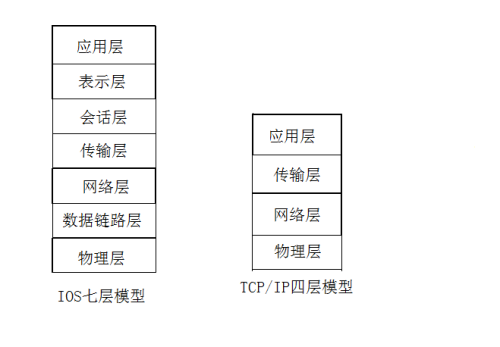

- [一、什么是计算机网络？](#一什么是计算机网络)
- [二、计算机通信的复杂度](#二计算机通信的复杂度)
- [三、ip地址](#三ip地址)
- [四、IP地址的分类](#四ip地址的分类)
  - [4.1、IPv4地址是4字节的](#41ipv4地址是4字节的)
  - [4.2、子网掩码](#42子网掩码)
  - [4.3、子网划分](#43子网划分)
  - [4.4、IOS和TCP/IP](#44ios和tcpip)
  - [4.5、端口号](#45端口号)
  - [4.6、TCP和UDP](#46tcp和udp)
  - [4.7、TCP的三次握手、四次挥手](#47tcp的三次握手四次挥手)
- [五、TCP的编程实现](#五tcp的编程实现)
  - [5.1、模型分析](#51模型分析)
  - [5.2、代码实现](#52代码实现)
  - [5.3、运行结果](#53运行结果)
- [六、UDP的编程实现](#六udp的编程实现)
  - [6.1、模型分析](#61模型分析)
  - [6.2、代码实现](#62代码实现)
  - [6.3、运行结果](#63运行结果)

## 一、什么是计算机网络？

多个计算机进行通信--->计算机网络。

## 二、计算机通信的复杂度

1. 传输信息的复杂度(种类、内容)；
2. 信息的数量
3. 传输距离(干扰...)
4. 信息的安全问题
5. 计算机体系的完整性和封闭性。

**既要保证计算机的封闭性，又要达成计算机的通信。**

## 三、ip地址

1. IP地址是有限的，需要一种方式将IP地址复用。
2. IP地址的复用导致了数据传递的复杂性(ATM，存储转发机制；路由机制)。
3. IP地址过于抽象不方便使用，于是给出了IP地址的人文化转义：域名。
4. 域名只能代表一个IP网络地址，于是就只能代表一个网络上的节点实体。
5. 实际上访问节点的时候，本质上使用的是IP地址，所以就需要将域名转化为IP地址(DNS...)

## 四、IP地址的分类

### 4.1、IPv4地址是4字节的

IP 地址中间以 . 划分；IPv6地址是16字节的；

规定：在IP地址划分上，一般不取全0/全1；

IP一般分为5类：Ａ、Ｂ、Ｃ、Ｄ、Ｅ，一般常用的IP地址为A类，B类，C类；

<div align=center></div>

- A类IP：第一个字节是以**0开头**  0000 0000--->0111 1111 **0~127**
- B类IP：第一个字节是以**10开头**  1000 0000--->1011 1111  **128~191**
- C类IP：第一个字节是以**110开头**   1100 0000--->1101 1111  **192~223**

### 4.2、子网掩码

**就是将网络号设置为1，主机号设置为0(对每一个字节的位进行设置)；**

例：C类IP地址，3个字节网络号和一个字节的主机号；

1111 1111 1111 1111 1111 1111 0000 0000

255       .     255     .      255     .     0

### 4.3、子网划分

**此时就存在C类地址的子网掩码不一定总是255.255.255.0；**

这还的看C类IP下面有没有子网划分，有子网划分的话，最后一个字节，也就是主机号可能为2段(01/10)、4段(00/01/10/11)

例：192.168.3.11xx xxxx  1111 1111 1111 1111 1111 1111 1100 0000

此时对应的子网掩码为：255.255.255.192

### 4.4、IOS和TCP/IP

模型分析：

<div align=center></div>

### 4.5、端口号

**port：唯一标识应用程序的编号；**

我们之间通过QQ、微信、邮箱进行收发数据时，没有导致数据的错乱接收，是怎么做到的呢？又是怎么一一对应找到的呢？

**通过端口号，识别了电脑上的某一应用程序，也就是找对应的编号。**

**我们在进行数据的发送时：首先通过IP寻找物理计算机，在根据port，寻找对应的应用程序。**

### 4.6、TCP和UDP

**UDP属于TCP/IP体系中的一部分。**

**TCP协议和UDP协议都属于传输层协议。**

TCP协议：

1. 面向连接的传输协议、可靠的、同步的；
2. 面向连接的网络传输特点：
   - 需要有一方主动的建立连接，另一方接收连接请求；
   - 只有建立了连接之后才能够进行数据的传输；
   - 当数据传输完毕之后，就需要释放连接，由连接的两端来共同决定连接是否保持。

UDP协议：

1. 面向无连接的：即就是在进行数据传输的时候，不需要预先创建一个连接；
2. 不可靠的：无法知道发送的数据是否能够到达目的，也无法知道什么时候能够到达目的。
3. 异步的：

### 4.7、TCP的三次握手、四次挥手

TCP--->至少3次握手(最后一次防止误按，2次的话，有可能死锁)；

打电话模型，模型分析：

<div align=center></div>

TCP--->4次挥手。

模型：男女朋友分手模型

<div align=center></div>

通过IP，只能保证物理上的连通，至于收发数据的形式是什么，都不归它管。

127.0.0.1：本机回送地址，可作为测试本机使用，不安装网卡也是可以ping通的。

## 五、TCP的编程实现

基础的socket编程对TCP的就是下面的步骤：

### 5.1、模型分析

<div align=center></div>

### 5.2、代码实现

utili.h

```cpp
#include<stdio.h>
#include<unistd.h>
#include<string.h>
#include<sys/socket.h>
#include<netinet/in.h>
#include<arpa/inet.h>

#define SERVER_PORT 9090
#define SERVER_IP  "127.0.0.1"
#define LISTEN_QUEUE    5
#define BUF_SIZE    255
```

服务器端代码：

```cpp
#include"utili.h"

//TCP
int main(void){
    int sockSer = socket(AF_INET, SOCK_STREAM, 0); 
    if(sockSer == -1){
        perror("socket");
        return -1; 
    }   

    struct sockaddr_in addrSer, addrCli;
    addrSer.sin_family = AF_INET;
    addrSer.sin_port = htons(SERVER_PORT);
    addrSer.sin_addr.s_addr = inet_addr(SERVER_IP);

    int yes = 1;
    setsockopt(sockSer, SOL_SOCKET, SO_REUSEADDR, &yes, sizeof(int)); //地址、端口的重用

    socklen_t len = sizeof(struct sockaddr);
    int res = bind(sockSer, (struct sockaddr *)&addrSer, len);
    if(res == -1){
        perror("bind");
        close(sockSer);
        return -1; 
    }   

    res = listen(sockSer, LISTEN_QUEUE);
    if(res == -1){
        perror("listen");
        close(sockSer);
        return -1;
    }

    int sockConn;
    char sendbuf[BUF_SIZE];
    char recvbuf[BUF_SIZE];
    while(1){
        sockConn = accept(sockSer, (struct sockaddr *)&addrCli, &len);
        if(sockConn == -1){
            continue;
        }else{
            printf("Server Accept Client Connect OK\n");
        }
        printf("Ser :>");
        scanf("%s", sendbuf);
        if(strncmp(sendbuf, "quit", 4) == 0)
            break;
        send(sockConn, sendbuf, strlen(sendbuf)+1, 0);

        recv(sockConn, recvbuf, BUF_SIZE, 0);
        printf("Cli :>%s\n", recvbuf);    
    }
    close(sockSer);

    return 0;
}
```

客户端代码：

```cpp
#include"utili.h"

//TCP
int main(void){
    int sockCli = socket(AF_INET, SOCK_STREAM, 0); 

    struct sockaddr_in addrSer;
    addrSer.sin_family = AF_INET;
    addrSer.sin_port = htons(SERVER_PORT);
    addrSer.sin_addr.s_addr = inet_addr(SERVER_IP);

    struct sockaddr_in addrCli;
    addrCli.sin_family = AF_INET;
    addrCli.sin_port = htons(7070);
    addrCli.sin_addr.s_addr = inet_addr("192.168.1.155");

    int yes = 1;
    setsockopt(sockCli, SOL_SOCKET, SO_REUSEADDR, &yes, sizeof(int)); //地址、端口的重用

    socklen_t len = sizeof(struct sockaddr);

    int res = bind(sockCli, (struct sockaddr *)&addrCli, len);
    if(res == -1){
        perror("bind");
        close(sockCli);
        return -1; 
    }   

    res = connect(sockCli, (struct sockaddr*)&addrSer, len);
    if(res == -1){
        perror("connect");
        close(sockCli);
        return -1;
    }else{
        printf("Client Connect Server ok\n");
    }

    char sendbuf[BUF_SIZE];
    char recvbuf[BUF_SIZE];
    while(1){
        connect(sockCli, (struct sockaddr*)&addrSer, len);
        recv(sockCli, recvbuf, BUF_SIZE, 0);
        printf("Ser :>%s\n", recvbuf);

        printf("Cli :>");
        scanf("%s", sendbuf);
        if(strncmp(sendbuf, "quit", 4) == 0)    
            break;
        send(sockCli, sendbuf, strlen(sendbuf)+1, 0);

    }
    close(sockCli);

    return 0;
}
```

### 5.3、运行结果

<div align=center></div>

<div align=center></div>

## 六、UDP的编程实现

基础的socket编程对UDP的就是下面的步骤：

### 6.1、模型分析

<div align=center></div>

### 6.2、代码实现

utili.h

```cpp
#include<unistd.h>
#include<stdio.h>
#include<string.h>
#include<sys/socket.h>
#include<netinet/in.h>
#include<arpa/inet.h>

#define SERVER_PORT  9090
#define SERVER_IP    "127.0.0.1"
#define LISTEN_QUEUE  5
#define BUFFER_SIZE   255
```

服务器端代码：

```cpp
#include"utili.h"

int main(){
    int sockSer = socket(AF_INET, SOCK_DGRAM, 0); 
    if(sockSer == -1){
        perror("socket");
        return -1; 
    }   
    struct sockaddr_in addrSer, addrCli;
    addrSer.sin_family = AF_INET;
    addrSer.sin_port = htons(SERVER_PORT);
    addrSer.sin_addr.s_addr = inet_addr(SERVER_IP);

    socklen_t len = sizeof(struct sockaddr);
    int res = bind(sockSer, (struct sockaddr*)&addrSer, len);
    if(res == -1){
        perror("bind");
        close(sockSer);
        return -1; 
    }   

    char sendbuf[BUFFER_SIZE];
    char recvbuf[BUFFER_SIZE];
    while(1){
        recvfrom(sockSer, recvbuf, BUFFER_SIZE, 0, (struct sockaddr*)&addrCli, &len);
        printf("Cli:>%s\n",recvbuf);
        
        printf("Ser:>");
        scanf("%s",sendbuf);
        if(strncmp(sendbuf, "quit", 4) == 0){
            break;
        }
        sendto(sockSer, sendbuf, strlen(sendbuf)+1, 0, (struct sockaddr*)&addrCli, len);
    }
    close(sockSer);
    return 0;
}
```

客户端代码：

```cpp
#include"utili.h"

int  main(){
    int sockCli = socket(AF_INET, SOCK_DGRAM, 0); 
    if(sockCli == -1){
        perror("socket");
        return -1; 
    }   

    struct sockaddr_in addrSer;
    addrSer.sin_family = AF_INET;
    addrSer.sin_port = htons(SERVER_PORT);
    addrSer.sin_addr.s_addr = inet_addr(SERVER_IP);

    char sendbuf[BUFFER_SIZE];
    char recvbuf[BUFFER_SIZE];
    socklen_t  len = sizeof(struct sockaddr);
    while(1){
        printf("Cli:>");
        scanf("%s",sendbuf);
        if(strncmp(sendbuf, "quit", 4) == 0){ 
            break;
        }   
        sendto(sockCli, sendbuf, strlen(sendbuf)+1, 0, (struct sockaddr*)&addrSer, len);

        recvfrom(sockCli, recvbuf, BUFFER_SIZE, 0, (struct sockaddr*)&addrSer, &len);
        printf("Ser:>%s\n",recvbuf);
    }
    close(sockCli);
    return 0;      
}
```

### 6.3、运行结果

服务器端截图：

<div align=center></div>

客户端截图：

<div align=center></div>

</br>

**服务端的套接字总领全局，不与任何客户端进行通信，为每一个新的客户端所分配一个新的套接字，进行通信。**

**LISTEN_QUEUE：等待队列的大小(最多等待多少队列)；**

**UDP：必须先知道服务器在哪。**
