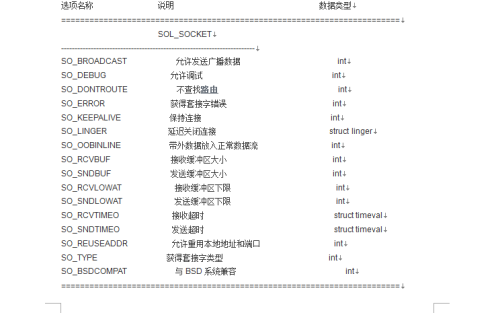

- [一、套接字](#一套接字)
- [二、setsockopt()的理解](#二setsockopt的理解)
- [三、套接字的查询表](#三套接字的查询表)
- [四、代码实现](#四代码实现)
  - [4.1、ser.c](#41serc)
  - [4.2、cli.c](#42clic)
  - [4.3、运行结果](#43运行结果)

## 一、套接字

在Linux的网络编程中，套接字是非常重要的，要想实现更复杂的应用，必定会涉及到调整套接字属性，使其能够实现地址重用，广播，数据缓存区等功能。

常用的API函数：

```cpp
int setsockopt(int sockfd, int level, int optname,const void *optval, socklen_t optlen);
```

## 二、setsockopt()的理解

1. 参数sockfd：用于指定要操作的套接字；
2. level：要查找的协议所对应的协议层；
   - SOL_SOCKET：通用套接字层
   - IPPROTO_IP：IP协议层，用于设置IP层
   - IPPROTO_TCP：TCP协议层，用于设置TCP。
3. optname：查表看要设置为什么功能
4. int yes = 1;   &yes
5. sizeof(int);

**关键点：必须要在绑定(bind()函数)之前设置套接字，调用setsockopt()；**

## 三、套接字的查询表

<div align=center></div>

<div align=center></div>

## 四、代码实现

### 4.1、ser.c

```cpp
#include<unistd.h>
#include<stdio.h>
#include<sys/socket.h>
#include<netinet/in.h>
#include<arpa/inet.h>
#include<stdlib.h>
#include<string.h>

int main(int argc, char *argv[]){
    int sockSer = socket(AF_INET, SOCK_STREAM, 0); 
    struct sockaddr_in addrSer, addrCli;
    addrSer.sin_family = AF_INET;
    addrSer.sin_port = htons(atoi(argv[2]));
    addrSer.sin_addr.s_addr = inet_addr(argv[1]);

    int yes = 1;
    setsockopt(sockSer, SOL_SOCKET, SO_REUSEADDR, &yes, sizeof(int));//设置的是允许本地端口和地址重用

    struct timeval timeout; //设置等待时间(这样将阻塞程序——>非阻塞程序)
    timeout.tv_sec = 5;  //秒
    timeout.tv_usec = 0;  //微秒
    setsockopt(sockSer, SOL_SOCKET, SO_RCVTIMEO, &timeout, sizeof(struct timeval));//设置的是服务器最多等客户端5秒

    socklen_t len = sizeof(struct sockaddr);
    int res = bind(sockSer,(struct sockaddr*)&addrSer, len);
    if(res == -1){
        perror("bind");
        close(sockSer);
        return -1;
    }

    listen(sockSer, 5);

    int sockConn;
    sockConn = accept(sockSer, (struct sockaddr*)&addrCli, &len);

    char buffer[256];
    while(1){
        recv(sockConn, buffer, 256, 0);
        printf("recv msg from client :> %s\n",buffer);
        send(sockConn, buffer, strlen(buffer)+1, 0);
    }
    close(sockSer);

    return 0;
```

### 4.2、cli.c

```cpp
#include<unistd.h>
#include<stdio.h>
#include<sys/socket.h>
#include<netinet/in.h>
#include<arpa/inet.h>
#include<stdlib.h>
#include<string.h>

int main(int argc, char *argv[]){
    int sockCli = socket(AF_INET, SOCK_STREAM, 0); 
    struct sockaddr_in addrSer;
    addrSer.sin_family = AF_INET;
    addrSer.sin_port = htons(atoi(argv[2]));
    addrSer.sin_addr.s_addr = inet_addr(argv[1]);

    socklen_t len = sizeof(struct sockaddr);
   
    connect(sockCli, (struct sockaddr*)&addrSer, len);

    char buffer[256];
    while(1){
        printf("Msg:>");
        scanf("%s",buffer);
        send(sockCli, buffer, strlen(buffer)+1, 0); 
        recv(sockCli, buffer, 256, 0); 
        printf("recv msg from self :> %s\n",buffer);
    }   
    close(sockCli);

    return 0;
}
```

### 4.3、运行结果

服务器端：

<div align=center></div>

客户端：

<div align=center></div>

</br>

本例：实现了端口和地址的重用，不用再更改其中的一个来进行再次编译；也将阻塞化为非阻塞，通过调整等待的时间；

套接字的设计用途还是很大的，可以在通信领域；

**套接字是文件描述符的一种；**
