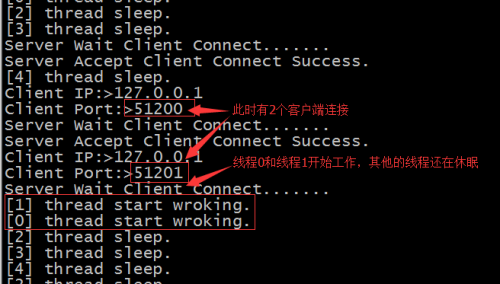

- [一、线程池网络服务](#一线程池网络服务)
- [二、代码实现](#二代码实现)
  - [2.1、utili.h](#21utilih)
  - [2.2、ser.c](#22serc)
  - [2.3、cli.c](#23clic)
  - [2.4、运行结果](#24运行结果)
- [三、分析总结](#三分析总结)

## 一、线程池网络服务

针对多线程网络服务模式的一些不足之处而提出的改进模式。

池是一个很重要的概念，其基本理念是：**先创建一批资源，当有用户到来时，直接分配以创建好的资源，它的主要目的是减少系统在频繁创建资源时的开销。**

实现原理：主服务线程创建既定数量的服务线程，当有客户端到来时，则从线程池中找出空闲的服务线程，为其服务，服务完毕后，线程不进行释放，重新放回线程池；若当前线程池已满，则将当前的客户端加入等待队列。

模型如下：

<div align=center></div>

## 二、代码实现

同样用处理整数运算来模拟线程池的并发处理。

### 2.1、utili.h

```cpp
#include<unistd.h>
#include<stdio.h>
#include<string.h>
#include<stdlib.h>
#include<sys/socket.h>
#include<netinet/in.h>
#include<arpa/inet.h>
#include<pthread.h>

#define SERVER_PORT  8090
#define SERVER_IP    "127.0.0.1"
#define LISTEN_QUEUE  5
#define BUFFER_SIZE   255
#define CMD_SIZE      20    

#define THREAD_POOL_NUM  5

typedef enum{ADD,SUB,MUL,DIV,MOD, QUIT}OPER_TYPE;
typedef enum{IDEL, BUSY}THREAD_TAG;

typedef struct OperStruct{
    int op1;
    int op2;
    OPER_TYPE oper;
}OperStruct;
```

### 2.2、ser.c

```cpp
#include"../utili.h"

typedef struct PoolStruct{
    int sockConn;
    THREAD_TAG flag; 
}PoolStruct;

typedef PoolStruct threadpool[THREAD_POOL_NUM];
threadpool pool;
pthread_t  tid[THREAD_POOL_NUM];

void* Thread_Handler(void *arg);

void* Thread_Handler(void *arg){
    int index = *(int *)arg;

    printf("[%d] thread start up.\n", index);

    OperStruct op; 
    int result;
    while(1){
        if(pool[index].flag == BUSY){
            printf("[%d] thread start wroking.\n", index);
            int res = recv(pool[index].sockConn, &op, sizeof(op), 0); 
            if(res == -1){
                printf("recv data fail.\n");
                continue;
            }
            if(op.oper == ADD){
                result = op.op1 + op.op2;
            }else if(op.oper == SUB){
                result = op.op1 - op.op2;
            }else if(op.oper == MUL){
                result = op.op1 * op.op2;
            }else if(op.oper == DIV){
                result = op.op1 / op.op2;
            }else if(op.oper == QUIT){
                break;
            }
            res = send(pool[index].sockConn, &result, sizeof(result), 0);
            if(res == -1){
                printf("send data fail.\n");
                continue;
            }
        }else{
            printf("[%d] thread sleep.\n",index);
            sleep(1);
        }
    }
    close(pool[index].sockConn);
    pthread_exit(0);
}    
int main(void){
    int sockSer = socket(AF_INET, SOCK_STREAM, 0);
    if(sockSer == -1){
        perror("socket");
        return -1;
    }
    struct sockaddr_in addrSer, addrCli;
    addrSer.sin_family = AF_INET;
    addrSer.sin_port = htons(SERVER_PORT);
    addrSer.sin_addr.s_addr = inet_addr(SERVER_IP);

    socklen_t len = sizeof(struct sockaddr);
    int res = bind(sockSer, (struct sockaddr*)&addrSer, len);
    if(res == -1){
        perror("bind");
        close(sockSer);
        return -1;
    }

    listen(sockSer, LISTEN_QUEUE);

    int i;
    for(i=0; i<THREAD_POOL_NUM; ++i){
        pthread_create(&tid[i], NULL, Thread_Handler, &i);
        sleep(1);
    }
    for(i=0; i<THREAD_POOL_NUM; ++i){    
        pool[i].sockConn = 0;
        pool[i].flag = IDEL;
    }

    int sockConn;
    while(1){
        printf("Server Wait Client Connect.......\n");
        sockConn = accept(sockSer, (struct sockaddr*)&addrCli, &len);
        if(sockConn == -1){
            printf("Server Accept Client Connect Fail.\n");
            continue;
        }else{
            printf("Server Accept Client Connect Success.\n");
            printf("Client IP:>%s\n", inet_ntoa(addrCli.sin_addr));
            printf("Client Port:>%d\n",ntohs(addrCli.sin_port));
        }
        for(i=0; i<THREAD_POOL_NUM; ++i){
            if(pool[i].flag == IDEL){
                pool[i].flag = BUSY;
                pool[i].sockConn = sockConn;
                break;
            }
        }
    }
    close(sockSer);
    return 0;
}
```

### 2.3、cli.c

```cpp
#include"utili.h"

void InputData(OperStruct *pt);

void InputData(OperStruct *pt){
    printf("please input op1 and op2 : ");
    scanf("%d %d", &(pt->op1), &(pt->op2));
}

//Cli
int main(void){
    int sockCli = socket(AF_INET, SOCK_STREAM, 0); 
    if(sockCli == -1){
        perror("socket");
        return -1; 
    }   
    struct sockaddr_in addrSer;
    addrSer.sin_family = AF_INET;
    addrSer.sin_port = htons(SERVER_PORT);
    addrSer.sin_addr.s_addr = inet_addr(SERVER_IP);

    socklen_t len = sizeof(struct sockaddr);
    int res = connect(sockCli, (struct sockaddr*)&addrSer, len);
    if(res == -1){
        perror("connect");
        close(sockCli);
        return -1; 
    }else{
        printf("Client Connect Server Success.\n");
    }

    char cmd[2];
    OperStruct  op;
    int result;
    while(1){
        printf("Please input operator : ");
        scanf("%s",cmd);
        if(strcmp(cmd, "+") == 0){
            op.oper = ADD;
            InputData(&op);
        }else if(strcmp(cmd,"-") == 0){
            op.oper = SUB;
            InputData(&op);
        }else if(strcmp(cmd,"*") == 0){
            op.oper = MUL;
            InputData(&op);
        }else if(strcmp(cmd,"/") == 0){
            op.oper = DIV;
            InputData(&op);
        }else if(strcmp(cmd, "quit") == 0){
            op.oper = QUIT;
        }else{
            printf("Cmd invalid.\n");   
       }

        res = send(sockCli, &op, sizeof(op), 0);
        if(res == -1){
            printf("send data fail.\n");
            continue;
        }
        if(op.oper == QUIT)
            break;
        res = recv(sockCli, &result, sizeof(result), 0);
        if(res == -1){
            printf("recv data fail.\n");
            continue;
        }
        printf("result = %d\n", result);
    }
    close(sockCli);
    return 0;
}
```

### 2.4、运行结果

服务器端：

<div align=center></div>

客户端1

<div align=center></div>

客户端2

<div align=center></div>

## 三、分析总结

1. 其优点：性能高效
2. 可能存在的问题：新用户如果在等待队列里耗时过长，会影响用户体验，针对此问题，改进方案如下：
   - **动态创建新的服务线程，服务结束后，该线程加入线程池，这种改进的好处是，用户体验得到提升，潜在问题是，在长时间，大规模的并发用户状态下，线程会产生很多，最终会因为资源消耗过多，系统退出。**
   - **增加一个线程资源回收机制，当线程池的规模达到一定程度或满足某种既定规则时，会主动杀死一些线程，以达到系统稳定和用户体验之间折中。**

模型分析

<div align=center></div>

**当有客户端来，有2种做法：**

1. **创建线程为其服务；**
2. **加入等待队列；这2种都不太合适，采用折中法，有一个上限值，即就是规定一个创建线程的最大数，当来一个用户，还没达到线程最大数时，为其创建线程，若达到了，则加入等待队列；**

**对线程资源的回收：**

1. **立马回收；**
2. **暂时不回收；当空闲的线程数达到某一下限值时，此时再将线程回收；**
