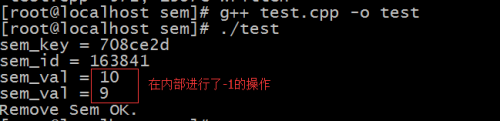

- [一、内核对进程访问的管理](#一内核对进程访问的管理)
- [二、信号量的编程](#二信号量的编程)
  - [2.1、创建/获取信号量](#21创建获取信号量)
  - [2.2、初始化信号量](#22初始化信号量)
  - [2.3、信号量的操作](#23信号量的操作)
  - [2.4、控制信号量](#24控制信号量)
- [三、信号量的特征](#三信号量的特征)
- [四、编程实现](#四编程实现)

## 一、内核对进程访问的管理

1. 进程在访问共享资源是存在冲突的，必须的有一种强制手段说明这些共享资源的访问规则。
   - 访问规则的原理：**当有一个进程在访问这些共享资源的时候，需要明确的向其他的进程表示：该资源已经被占用。**
2. 访问规则：现代操作系统一定是多进程的(多任务)，多进程的环境一定存在共享资源的访问冲突问题。操作系统提供了一种机制对"访问规则的原理"进行的实现。
   - **用一种数量去标识某一种共享资源的个数(空闲)。**
   - **当有进程需要访问对应的共享资源的时候，则需要先查看(申请)，根据资源对应的当前可用数量进行申请。(申请所需要使用的资源个数)**
   - **资源的管理者(操作系统内核)，就使用当前的资源个数减去要申请的资源个数，结果>=0，表示有可用资源，允许该进程继续访问；否则表示资源不可用，则告诉进程(暂停或者立即返回)；**
   - **资源数量的变化就表示资源的占用和释放。占用：使得可用资源减少；释放：使得可用资源增加。**

## 二、信号量的编程

这种表示**资源个数**的处理共享资源访问规则的方式--->信号量。

### 2.1、创建/获取信号量

Linux为了方便进程对于信号量的编程操作，通过一个key创建的一个信号量并非只是一个信号量，而是一个信号量集合。

为了方便进程间信号量的管理，在Linux的内核设计中，对于信号量的申请(创建)，一个key值可以创建一组信号量。就可以使得进程间是约定一个key值，而控制一组共享资源的访问。

需要使用API：semget()方法

```cpp
  int semget(key_t key, int nsems, int semflg);
```

其中nsems参数表示此次创建的信号量集合中信号量的个数(表示有多少种共享资源需要管理)。该数字大于0，小于系统规定的最大值，该最大值的描述存放在文件/etc/sysctl.conf。

### 2.2、初始化信号量

信号量ID事实上是信号量集合的ID，一个ID对应的是一组信号量。此时就使用信号量ID设置整个信号量集合，这种操作分为2种大的可能性。

- 针对信号量集合中的一个信号量进行设置；信号量集合中的信号量是按照数组的方式被管理起来的，从而可以直接使用信号的数组下标来进行访问。
- 针对整个信号量集和进行统一的设置。

需要使用的API：semctl()方法。

```cpp
int semctl(int semid, int semnum, int cmd, ...);
```

cmd参数
参数|作用
|:--|:--|
GETALL|获取信号量集合中所有信号量的资源个数
SETALL|设置所有
GETVAL|获取其中一个
SETVAL|设置其中一个

第四个参数 可变参

如果cmd是GETALL、SETALL、GETVAL、SETVAL...的话，则需要提供第四个参数。第四个参数是一个共用体，**这个共用体在程序中必须的自己定义（作用：初始化资源个数）**，定义格式如下：

```cpp
union semun {
  int val;    /* Value for SETVAL */
  struct semid_ds *buf;    /* Buffer for IPC_STAT, IPC_SET */
  unsigned short  *array;  /* Array for GETALL, SETALL */
  struct seminfo  *__buf;  /* Buffer for IPC_INFO
  (Linux-specific) */
};
```

### 2.3、信号量的操作

需要使用的API：semop()方法。  (op：operator操作)

```cpp
int semop(int semid, struct sembuf *sops, unsigned nsops);
```

第二个参数需要借助结构体struct sembuf：

```cpp
struct sembuf{
  unsigned short sem_num;  /* semaphore number  数组下标 */
  short sem_op;   /* semaphore operation */
  short sem_flg;  /* operation flags 默认0*/
}；
```

第三个参数一般情况下为1。

### 2.4、控制信号量

信号量控制：信号量集合中各个信号量的资源个数的设置与获取。

## 三、信号量的特征

**如果有进程通过信号量申请共享资源，而且此时资源个数已经小于0，则此时对于该进程，有两种可能性：等待资源，不等待。**

**如果此时进程选择等待资源，则操作系统内核会针对该信号量构建进程等待队列，将等待的进程加入到该队列之中。**

如果此时有进程释放资源，则会：

1. **先将资源个数增加；**
2. **从等待队列中抽取第一个进程；**
3. **根据此时资源个数和第一个进程需要申请的资源个数进行比较，结果大于0，则唤醒该进程；结果小于0，则让该进程继续等待。**

## 四、编程实现

实现一个简单的运用信号量的程序：

```cpp
#include<stdio.h>
#include<unistd.h>
#include<sys/ipc.h>
#include<sys/sem.h>

union semun {
    int  val;    /* Value for SETVAL */
    struct semid_ds *buf;    /* Buffer for IPC_STAT, IPC_SET */
    unsigned short  *array;  /* Array for GETALL, SETALL */
    struct seminfo  *__buf;  /* Buffer for IPC_INFO (Linux-specific) */
};

int main(void){
    key_t sem_key;
    sem_key = ftok("test", 7); //动态获取key； 
    if(sem_key == -1){
        perror("ftok");
        return -1; 
    }   
    printf("sem_key = %x\n",sem_key);

    int sem_id = semget(sem_key, 1, IPC_CREAT|IPC_EXCL|0755); //创建的共享资源数为1个
    if(sem_id == -1){
        perror("semget");
        return -1; 
    }   
    printf("sem_id = %d\n",sem_id);

    union semun init;
    init.val = 10;
    int res = semctl(sem_id, 0, SETVAL, init); //数组下标为0的
    if(res == -1){
        perror("semctl setval");
        return -1;
    }

    int sem_val = semctl(sem_id, 0, GETVAL);  //10
    printf("sem_val = %d\n",sem_val);

    struct sembuf info;
    info.sem_num = 0;
    info.sem_op = -1; //减少资源
    info.sem_flg = 0;

    semop(sem_id, &info, 1); //1：代表针对1个信号量资源
    sem_val = semctl(sem_id, 0, GETVAL);  //9
    printf("sem_val = %d\n",sem_val);

    res = semctl(sem_id, 0, IPC_RMID);
    if(res == -1){
        perror("semctl rmid");
        return -1;
    }    
    printf("Remove Sem OK.\n");
    return 0;
}
```

运行结果：

<div align=center></div>
