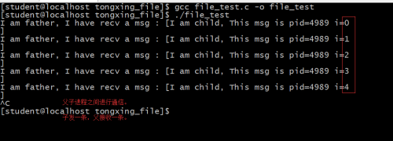

- [一、信号的局限性](#一信号的局限性)
- [二、基于文件的进程间通信](#二基于文件的进程间通信)
- [三、文件间的往来通信](#三文件间的往来通信)

## 一、信号的局限性

进程虽然高度独立和封闭，但进程依然有通信的需要。

**信号——中断，信号能够实现一定程度的进程间通信，但它是高度抽象，所表达的含义是告诉某一个进程什么事情发生了。信号却不能够传递复杂的、有效的、具体的数据，这就是信号的局限性。**

就需要其他的手段来构建进程间复杂数据的传递。

## 二、基于文件的进程间通信

早期的系统中，为了能够让进程之间方便的共享数据，最容易想到的解决方案就是，使用磁盘上的文件系统(因为文件系统对于所有进程都是公开且共享的)。

进行文件间通信代码：

```cpp
#include<stdio.h>
#include<unistd.h>
#include<string.h>
#include<fcntl.h>
#include<stdlib.h>
#include<sys/types.h>

int main(void){
    pid_t pid;
    int fd; 
    char buf[80];

    pid = fork();
    if(pid == 0){ 
        fd = open("./tmp", O_CREAT | O_WRONLY, 0755);
        if(fd < 0){ 
            perror("");
            exit(-1);
        }   
        sprintf(buf, "I am child, This msg is pid=%d\n", getpid());
        write(fd, buf, strlen(buf));
        close(fd);
        sleep(5);
    }else if(pid > 0){ 
        sleep(1);
        fd = open("./tmp", O_APPEND | O_RDONLY);
        if(fd < 0){ 
            perror("");
            exit(-1);
        }
        read(fd, buf, sizeof(buf));
        printf("I am father, I have recv a msg : [%s]\n", buf);
        close(fd);
    }else{
        perror("");
    }

    return 0;
}
```

运行结果：

<div align=center></div>

## 三、文件间的往来通信

**为了能够实现两个进程通过文件进行有序的数据交流，还得借助于信号的处理机制。**

1. **通过pause()等待对方发起一个信号，已确认可以开始执行下一次读/写操作；**
2. **通过kill()方法向对方发出明确的信号：可以开始下一步执行(读、写)；**

文件通信，代码如下：

```cpp
#include<stdio.h>
#include<unistd.h>
#include<string.h>
#include<fcntl.h>
#include<stdlib.h>
#include<signal.h>
#include<sys/types.h>

void catch_SIGUSR1(int sig){}

int main(void){
    pid_t pid;
    int fd; 
    char buf[80];
    int i;

    signal(SIGUSR1, catch_SIGUSR1);
    pid = fork();
    if(pid == 0){ 
        fd = open("./tmp", O_CREAT | O_WRONLY, 0755);
        if(fd < 0){ 
            perror("");
            exit(-1);
        }
        for(i = 0; i < 5; i++){
            sprintf(buf, "I am child, This msg is pid=%d i=%d\n", getpid(), i);
            write(fd, buf, strlen(buf));
            sleep(1);   //速度太快，写完的休眠1秒，有时间让父进程读取数据。
            kill(getppid(),SIGUSR1);
            pause();
        }
        close(fd);
        sleep(5);
    }else if(pid > 0){
        pause();
        fd = open("./tmp", O_APPEND | O_RDONLY);
        if(fd < 0){
            perror("");
            exit(-1);
        }
        for(i = 0; i < 5; i++){
            read(fd, buf, sizeof(buf));
            printf("I am father, I have recv a msg : [%s]\n", buf);
            sleep(1);   //速度太快，读完的休眠1秒，有时间让子进程写入数据。
            kill(pid, SIGUSR1);    
            pause();
        }
        close(fd);
    }else{
        perror("");
    }

    return 0;
}
```

运行结果：

<div align=center></div>

</br>

这样就利用文件达到了父子进程之间的通信了。

由以上的代码可以看出：直接通过文件的方式进行的进程间的通信的编程控制是非常复杂的，就需要一种更加简洁的处理方案。
