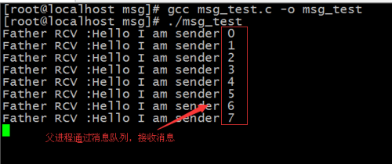

- [一、消息队列的简介](#一消息队列的简介)
- [二、创建/获取消息队列](#二创建获取消息队列)
- [三、使用消息队列](#三使用消息队列)
- [四、消息队列实现](#四消息队列实现)
- [五、一问一答的模式](#五一问一答的模式)
- [六、进程间通信总结](#六进程间通信总结)

## 一、消息队列的简介

消息队列就是在进程之间架设起通信的通道，信息在通道中传递(具有时间先后的)，从宏观逻辑上来讲与管道是一致的。即就是消息队列也同样是：

1. 具有入口和出口；
2. 消息从入口到出口，是FIFO的；
3. 所以消息在其中是队列的存储形式。

消息队列与管道不同的地方在于：管道中的数据并没有分割为一个一个的数据独立单位，在字节流上是连续的。然而，消息队列却将数据分成了一个一个独立的数据单位，每一个数据单位被称为消息体。每一个消息体都是固定大小的存储块儿，在字节流上是不连续的。

## 二、创建/获取消息队列

需要使用的API：msgget()方法；

```cpp
int msgget(key_t key, int msgflg); //通过msgget()所创建的消息队列并非是一个消息队列，而是一个可扩展的消息队列集合。
```

为了简化程序的编写，于是将其设计为：一个key可以创建一个消息队列集合。

1. **无法确定进程间通信到底需要多少个消息队列；**
2. **为了节省内存资源(操作系统内核资源)，所以消息队列集合的消息队列是可以扩展的；**
3. **通过msgget()新创建的消息队列集合拥有0个消息队列。在使用消息队列集合中的需要使用的(type指定的消息队列)消息队列时，就会创建对应的消息队列。**

**type是msgsnd和msgrcv方法中提供的值。**

## 三、使用消息队列

消息的发送和消息的接收。

```cpp
int msgsnd(int msqid, const void *msgp, size_t msgsz, int msgflg);

ssize_t msgrcv(int msqid, void *msgp, size_t msgsz, long msgtyp,int msgflg);
```

1. **msgtyp参数值指的是消息队列集合中某一个消息队列的自定义编号。通过该参数识别消息队列集合中的消息队列，以便从该队列中读取消息体。**
2. **msgsnd()方法在发送消息的时候，是在消息体结构体中指定，当前的消息发送到消息队列集合中的哪一个消息队列上。**
3. **消息体结构体中就必须包含一个type值，type值是long类型，而且还必须是结构体的第一个成员。而结构体中的其他成员都被认为是要发送的消息体数据。**
4. **无论是msgsnd()发送还是msgrcv()接收时，只要操作系统内核发现新提供的type值对应的消息队列集合中的消息队列不存在，则立即为其创建该消息队列。**

**总结：为了能够顺利的发送与接收，发送方与接收方需要约定：i>、同样的消息体结构体；(2)、发送方与接收方在发送和接收的数据块儿大小上要与消息结构体的具体数据部分保持一致！**

*重点注意：*

> ***消息结构体被发送的时候，只是发送了消息结构体中成员的值，如果结构体成员是指针，并不会将指针所指向的空间的值发送，而只是发送了指针变量所保存的地址值。数组作为消息体结构体成员是可以的。因为整个数组空间都在消息体结构体中。***

## 四、消息队列实现

代码如下：

```cpp
#include<stdio.h>
#include<unistd.h>
#include<sys/ipc.h>
#include<sys/msg.h>

#define KEY 0x9999

typedef struct{
    long msgType;
    char data[80];
}MsgBody;

int main(void){
    pid_t pid;
    int msgid;
    int i = 0;
    int ret;
    MsgBody msg;

    pid = fork();
    if(pid == 0){ 
        msgid = msgget(KEY, IPC_CREAT | 0666);
        if(msgid == -1){
            perror("");
            return -1; 
        }   
        while(1){
            msg.msgType = 222;
            sprintf(msg.data, "Hello I am sender %d", i);
            msgsnd(msgid, &msg, sizeof(MsgBody) - sizeof(long), 0);
            i++;
            sleep(1);
        }
    }else if(pid > 0){
        msgid = msgget(KEY, IPC_CREAT | 0666);
        if(msgid == -1){
            perror("");
            return -1;
        }
        while(1){
            ret = msgrcv(msgid, &msg, sizeof(MsgBody) - sizeof(long), 222, 0);
            if(ret < 0){
                perror("");
                return -1;
            }
            printf("Father RCV :%s\n", msg.data);
        }


    }else{
        perror("");
        return -1;
    }   

    return 0;
}
```

运行结果：

<div align=center></div>

</br>

注意的是：下面这个结构体是发送/接收的第二个参数，得好好理解。

```cpp
struct msgbuf{
  long mtype;   //自己制定要传输的消息队列的编号(由自己任意指定);    
  char mtext[1]; //只能是数组，不能是指针。    
};
```

**long mtype制定消息队列编号，下面的数组才是要发送的数据，计算大小，也是这个数组所申请的空间大小。接收方倒数第二个参数为：mtype的值(制定的消息队列编号)。**

## 五、一问一答的模式

1、代码如下

服务器端代码：

```cpp
#include<stdio.h>
#include<unistd.h>
#include<stdlib.h>
#include<string.h>
#include<sys/ipc.h>
#include<sys/msg.h>

typedef struct Msg{
    long msg_type;
    char msg_data[80];
}Msg;

#define SEND    100
#define RECV    200

int main(void){
    key_t msg_key = ftok("tmp", 7); 
    int msgid = msgget(msg_key, IPC_CREAT | IPC_EXCL | 0755);

    Msg msg;
    while(1){
        printf("Ser :>");
        scanf("%s", msg.msg_data);
        if(strncmp(msg.msg_data, "quit", 4) == 0){ 
            break;
        }   
        msg.msg_type = SEND;
        msgsnd(msgid, &msg, strlen(msg.msg_data)+1, 0);

        msgrcv(msgid, &msg, 80, RECV, 0);
        printf("Cli :>%s\n", msg.msg_data);
     }   
     return 0;
}
```

客户端代码：

```cpp
#include<stdio.h>
#include<unistd.h>
#include<stdlib.h>
#include<string.h>
#include<sys/ipc.h>
#include<sys/msg.h>

typedef struct Msg{
    long msg_type;
    char msg_data[80];
}Msg;

#define SEND    200
#define RECV    100

int main(void){
    key_t msg_key = ftok("tmp", 7); 
    int msgid = msgget(msg_key, 0); 

    Msg msg;
    while(1){
        msgrcv(msgid, &msg, 80, RECV, 0); 
        printf("Ser :>%s\n", msg.msg_data);

        printf("Cli :>");
        scanf("%s", msg.msg_data);
        if(strncmp(msg.msg_data, "quit", 4) == 0){
            break;
        }
        msg.msg_type = SEND;
        msgsnd(msgid, &msg, strlen(msg.msg_data)+1, 0);

    }

    return 0;
}
```

2、运行结果

服务器端结果：

<div align=center></div>

客户端结果：

<div align=center></div>

## 六、进程间通信总结

1. ipcs：查看IPC资源； ipcs -m  ipcs -s  ipcs -q;
2. IPC资源的命令删除:：ipcrm -m shmid  ipcrm -s semid  ipcrm -q msgid;

进程间的通信需要传递什么信息?

- 信号(当......发生之时)；
- 共享内存、文件(共享资源)；
- 信号量(共享资源的访问规则)；
- 管道、消息队列(具有时间顺序的消息)；
