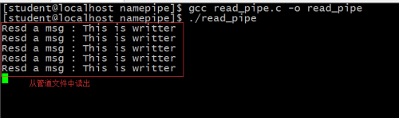
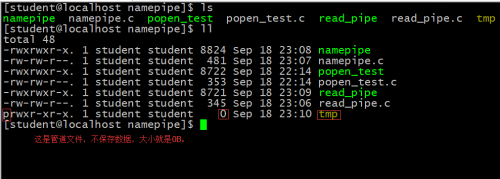

- [一、管道](#一管道)
- [二、无名管道](#二无名管道)
- [三、怎样实现一个父子进程一问一答的通信模式？](#三怎样实现一个父子进程一问一答的通信模式)
  - [3.1、2个管道](#312个管道)
  - [3.2、popen()方法](#32popen方法)
- [四、有名管道(命名管道)](#四有名管道命名管道)


## 一、管道

管道通信——只能在一台电脑上面运行。

管道：一定是半双工的通信，只能流向一个方向(规定流向)；

管道是一个进程间通信的概念，在要通信的进程间构建一个**单向的数据流动**的通道。数据通过该通道从一个进程流向另一个进程时是**具有时间先后顺序**的。就像是在进程间架起了一个"管道"。

模型分析：

<div align=center></div>

管道的实现：在Linux(Posix标准)的操作系统下，管道是通过文件来实现的。在后来的操作系统的发展中，依然使用了文件的访问方式来使用管道，但是具体的**管道已经从外存挪到了内存。**

## 二、无名管道

**只能用于亲缘关系的父子进程。**

pipe()方法： 

```cpp
int pipe(int pipefd[2]);
```

pipe方法会创建一对文件描述符，他们指向同一个管道文件，这2个文件描述符会放在参数pipefd数组中。pipefd[0]持有对管道文件的读，pipefd[1]持有对管道文件的写。

**管道文件在pipe操作的时候会被打开2次，分别以只读方式和只写方式打开。从管道的基本逻辑出发，其实就是管道的出口和入口。只要将这2个文件描述符分别交给不同的进程，就能够实现2个进程之间的单向通信。**

管道通信的简单代码：

```cpp
#include<stdio.h>
#include<stdlib.h>
#include<unistd.h>
#include<string.h>
#include<fcntl.h>

int main(void){
    pid_t pid;
    int fd[2];
    char buf[80];

    int res = pipe(fd);  //fd[0]  fd[1]
    if(res < 0){ 
        perror("");
        return -1; 
    }   
    pid = fork();
    if(pid == 0){ 
        close(fd[0]);
        sleep(2);
        sprintf(buf, "I am child, who are you");
        write(fd[1], buf, strlen(buf));
        close(fd[1]);
    }else if(pid > 0){
        close(fd[1]); 
        read(fd[0], buf, sizeof(buf));
        printf("Received a msg buf = %s\n", buf);
        close(fd[0]);
    }else{
        perror("");
    }

    return 0;
}
```

运行结果：

<div align=center></div>

</br>

中间暂停了2秒，才出现这个结果。

管道通信的特征：

1. **如果管道为空，从管道读取数据的一方会阻塞。直到管道中有新的数据为止。**
2. **管道的数据通信具有FIFO特性，这样可以避免数据的混乱。**
3. **管道数据的读取与发送并没有次数限制，而是管道是否为空时最重要的指标。**
4. **这种管道的使用具有一个最大的局限性：只适用于父子进程之间。从程序的设计中可以看到，管道的创建是父进程完成的，而且是在创建子进程之前，从而才使得子进程拥有了管道文件描述符，才能够使得父子进程约定持有管道的入口或出口。**
5. **一个管道只能实现单向的数据流动。**

## 三、怎样实现一个父子进程一问一答的通信模式？

### 3.1、2个管道

分析：因为管道具有单向的数据流动的特性，是半双工的，要实现双方的通信，那就必须是全双工。此时就需要2个管道完成这个功能。

模型分析

<div align=center></div>

代码实现父子进程之间的一问一答的通信：

```cpp
#include<unistd.h>
#include<stdlib.h>
#include<string.h>
#include<sys/wait.h>
#include<fcntl.h>

int main(void){
    int fd1[2];  //管道1的文件描述符
    int fd2[2];  //管道2的文件描述符
    int res = pipe(fd1);
    if(res == -1){
        perror("");
    }   
    res = pipe(fd2);
    if(res == -1){
        perror("");
    }   

    pid_t pid;
    pid = fork();
    if(pid == 0){ 
        char child_speak[80] = {'h'};;
        char buf[80];
        close(fd1[0]);
        close(fd2[1]);

        while(strncmp(child_speak, "quit", 4) != 0){ 
            printf("child :>");
            scanf("%s", child_speak);
            sprintf(buf, "%s", child_speak);
            write(fd1[1], buf, strlen(buf));

            read(fd2[0], buf, sizeof(buf));

        }

        close(fd1[1]);
        close(fd2[0]);

    }else if(pid > 0){
        char parent_speak[80] = {'w'};
        char buf[80];
        close(fd1[1]);
        close(fd2[0]);

        while(strncmp(parent_speak, "quit", 4) != 0){
            read(fd1[0], buf, sizeof(buf));

            printf("parent :>");
            scanf("%s", parent_speak);
            sprintf(buf, "%s", parent_speak);
            write(fd2[1], buf, strlen(buf));
        }
            
        close(fd1[0]);
        close(fd2[1]);
        int status;
        wait(&status);

    }else{
        perror("");
    }

    return 0;
}
```

运行结果：

<div align=center></div>

### 3.2、popen()方法

popen()能够执行命令行内容，fork一个子进程，让子进程execv命令行，将命令行的标准输出内容写入管道文件，然后将管道文件的FIFE指针作为返回值返回。

popen依然是父子进程间的通信。

实现代码如下：

```cpp
#include<stdio.h>
#include<unistd.h>
#include<stdlib.h>
#include<string.h>

int main(void){
    FILE *fp = popen("ls -l", "r");
    if(fp == NULL){
        perror("popen Error");
        return -1; 
    }   

    char buf[80];
    int ret;
    while(!feof(fp)){
        ret = fread(buf, sizeof(buf), 1, fp);
        if(ret == 0){ 
            perror("");
            break;
        }   
        printf("%s", buf);

    }   
    
    return 0;
}
```

运行结果：

<div align=center></div>

## 四、有名管道(命名管道)

普通的管道只能在父子进程之间通信，如果需要使用管道达成非父子进程间的通信，则需要特殊手段。有名管道就是这个技术，其含义就是：给一个管道命名，只要知道该管道名称的进程就可以使用该管道进行通信。

需要使用的API： **mkfifo**

初级使用的有名管道，代码如下，写的一方：

```cpp
#include<stdio.h>
#include<unistd.h>
#include<stdlib.h>
#include<string.h>
#include<sys/types.h>
#include<sys/stat.h>
#include<fcntl.h>

int main(void){
    int ret;
    char buf[80];

    ret = mkfifo("./tmp", 0755);  //创建一个管道文件
    if(ret != 0){ 
        perror("");
        return -1; 
    }   

    int fd = open("./tmp", O_CREAT | O_WRONLY);  //只写方式打开管道文件。返回管道文件的文件描述符。
    if(fd < 0){ 
        perror("");
        return -1; 
    }   

    while(1){
        memset(buf, 0, sizeof(buf));
        sprintf(buf, "This is writter");
        write(fd, buf, strlen(buf));
        sleep(1);
    }

    return 0;
}
```

代码如下，读的一方：

```cpp
#include<stdio.h>
#include<unistd.h>
#include<stdlib.h>
#include<string.h>
#include<fcntl.h>

int main(void){
    int fd; 
    char buf[80];

    fd = open("./tmp", O_APPEND, O_RDONLY); //以只读方式打开文件
    if(fd < 0){ 
        perror("");
        return -1; 
    }   

    while(1){
        memset(buf, 0, sizeof(buf));
        read(fd, buf, sizeof(buf));
        printf("Resd a msg : %s\n", buf);
    }   

    return 0;
}
```

运行结果：

<div align=center></div>

<div align=center></div>

</br>

对有名管道文件的总结：

1. **两个非父子进程通过有名管道来通信；**
2. **管道文件只需要一个进程去创建，其它进程只要有，直接用就行了；**
3. **mkfifo会在文件系统中创建一个管道文件，然后使其映射内存的一个特殊区域，凡是能够打开mkfifo创建的管道文件进程，都可以使用该文件实现FIFO的数据流动。**
4. **数据在有名管道中如果被读取，则不会继续存在于有名管道中。**
5. **管道文件不是磁盘上真真正正的文件，它是一块内存区域；**
