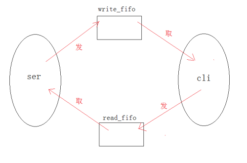
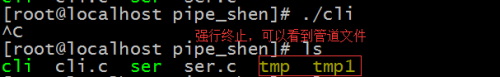
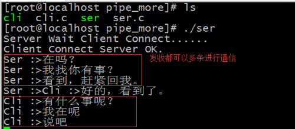

- [一、有名管道怎么实现C/S模型？](#一有名管道怎么实现cs模型)
  - [1.1、服务器端代码](#11服务器端代码)
  - [1.2、客户端代码](#12客户端代码)
  - [1.3、运行结果](#13运行结果)
- [二、怎么对上面的这个一问一答进行扩充？](#二怎么对上面的这个一问一答进行扩充)
  - [2.1、服务器端代码](#21服务器端代码)
  - [2.2、客户端代码](#22客户端代码)
  - [2.3、运行结果](#23运行结果)

## 一、有名管道怎么实现C/S模型？

此时我要做的就是服务器端，跟客户端进行通信，必须的打开2个终端进行不同进程间的通信。

思路分析：

1. **首先必须的有2个管道文件；服务器端创建一个管道文件，客户端创建一个管道文件。**
2. **服务器端的管道文件首先进行发送，客户端的对应该管道文件进行接收；客户端创建的管道文件，服务器端对应该管道文件进行接收。**
3. **因为管道具有阻塞的性质，服务器端(发-->读)，客户端(读-->发)，就可以实现通信了。**

模型分析：

<div align=center></div>

代码实现

### 1.1、服务器端代码

```cpp
#include<stdio.h>
#include<unistd.h>
#include<stdlib.h>
#include<string.h>
#include<fcntl.h>

#define write_fifo  "./tmp"
#define read_fifo   "./tmp1"

int main(void){
    int res = mkfifo(write_fifo, O_CREAT | O_EXCL | 0755);
    if(res == -1){
        perror("mkfifo");
        return -1; 
    }   
    printf("Server Wait Client Connect......\n");
    int write_fd;
    write_fd = open(write_fifo, O_WRONLY);
    if(write_fd == -1){
        perror("open write_fifo");
        unlink(write_fifo);
        return -1; 
    }   

    int read_fd;
    while((read_fd = open(read_fifo, O_RDONLY)) == -1){
        sleep(1);
    }
    printf("Client Connect Server OK.\n");

    char sendbuf[80];
    char recvbuf[80];

    while(1){
        printf("Ser :>");
        scanf("%s", sendbuf);
        if(strncmp(sendbuf, "quit", 4) == 0){
            break;
        }
        write(write_fd, sendbuf, strlen(sendbuf)+1);

        read(read_fd, recvbuf, sizeof(recvbuf));
        printf("Cli :>%s\n", recvbuf);
    }

    unlink(write_fifo);
    return 0;
}
```

### 1.2、客户端代码

```cpp
#include<stdio.h>
#include<unistd.h>
#include<stdlib.h>
#include<string.h>
#include<fcntl.h>

#define write_fifo  "./tmp"
#define read_fifo   "./tmp1"

int main(void){
    int read_fd = open(write_fifo, O_RDONLY);
    if(read_fd == -1){
        perror("open");
        return -1; 
    }   

    int res = mkfifo(read_fifo, O_CREAT | O_EXCL | 0755);
    if(res == -1){
        perror("mkfifo");
        return -1; 
    }   
    int write_fd = open(read_fifo, O_WRONLY);
    if(write_fd == -1){
        perror("open read_fifo");
        unlink(read_fifo);
        return -1; 
    }   

    char sendbuf[80];
    char recvbuf[80];
    while(1){
        read(read_fd, recvbuf, sizeof(recvbuf));
        printf("Ser :>%s\n", recvbuf);
        printf("Cli :>");
        scanf("%s", sendbuf);
        if(strncmp(sendbuf, "quit", 4) == 0){
            break;
        }
        write(write_fd, sendbuf, strlen(sendbuf)+1);
    }

    unlink(read_fifo);
    return 0;
}
```

### 1.3、运行结果

服务器端截图：

<div align=center></div>

客户端截图：

<div align=center></div>

看管道文件截图：

<div align=center></div>

## 二、怎么对上面的这个一问一答进行扩充？

就是形成一个人可以发多条语句(不在是上面的一人一条语句)？

思路分析：

1. **这就的在有名管道，服务器层和客户端层上分别形成一个父子进程；**
2. **因为管道有阻塞的作用，服务器端子进程先进行发数据(收数据的父进程因为管道此时为空，被阻塞)，而因为是子进程，可以在循环中一次发多条语句，让另一端收到。另一端发数据时，该端的发数据就被阻塞了；**
3. **就这样，利用父子进程进行收发收据，就可以达到多条语句的发送。**

跟上面是一个模型，只不过进行了扩展。

代码实现

### 2.1、服务器端代码

```cpp
#include<stdio.h>
#include<unistd.h>
#include<stdlib.h>
#include<string.h>
#include<fcntl.h>

#define write_fifo  "./tmp"
#define read_fifo   "./tmp1"

void sendData(int write_fd);
void recvData(int read_fd);

void recvData(int read_fd){
    char recvbuf[80];
    while(1){
        read(read_fd, recvbuf, sizeof(recvbuf));
        printf("Cli :>%s\n", recvbuf);
    }
}

void sendData(int write_fd){
    char sendbuf[80];
    while(1){
        printf("Ser :>");
        scanf("%s", sendbuf);
        if(strncmp(sendbuf, "quit", 4) == 0){
            break;
        }
        write(write_fd, sendbuf, strlen(sendbuf)+1);
    }
}

int main(void){
    int res = mkfifo(write_fifo, O_CREAT | O_EXCL | 0755);
    if(res == -1){
        perror("mkfifo");
        return -1;
    }
    printf("Server Wait Client Connect......\n");
    int write_fd;
    write_fd = open(write_fifo, O_WRONLY);
    if(write_fd == -1){
        perror("open write_fifo");
        unlink(write_fifo);   //关闭管道文件。
        return -1;
    }

    int read_fd;
    while((read_fd = open(read_fifo, O_RDONLY)) == -1){
        sleep(1);
    }
    printf("Client Connect Server OK.\n");

    pid_t pid; 
    pid = fork();
    if(pid == 0){
        sendData(write_fd);
        return -1;
    }else if(pid > 0){
        recvData(read_fd);
        int status;
        wait(&status);
    }else{
        perror("fork");
    }

    unlink(write_fifo);
    return 0;
}
```

### 2.2、客户端代码

```cpp
#include<stdio.h>
#include<unistd.h>
#include<stdlib.h>
#include<string.h>
#include<fcntl.h>

#define write_fifo  "./tmp"
#define read_fifo   "./tmp1"


void sendData(int write_fd);
void recvData(int read_fd);

void recvData(int read_fd){
    char recvbuf[80];
    while(1){
        read(read_fd, recvbuf, sizeof(recvbuf));
        printf("Ser :>%s\n", recvbuf);
    }   
}

void sendData(int write_fd){
    char sendbuf[80];
    while(1){
        printf("Cli :>");
        scanf("%s", sendbuf);
        if(strncmp(sendbuf, "quit", 4) == 0){ 
            break;
        }
        write(write_fd, sendbuf, strlen(sendbuf)+1);
    }
}

int main(void){
    int read_fd = open(write_fifo, O_RDONLY);
    if(read_fd == -1){
        perror("open");
        return -1;
    }

    int res = mkfifo(read_fifo, O_CREAT | O_EXCL | 0755);
    if(res == -1){
        perror("mkfifo");
        return -1;
    }
    int write_fd = open(read_fifo, O_WRONLY);
    if(write_fd == -1){
        perror("open read_fifo");
        unlink(read_fifo);
        return -1;
    }

    pid_t pid;      
    pid = fork();
    if(pid == 0){
        sendData(write_fd);
        return -1;
    }else if(pid > 0){
        recvData(read_fd);
        int status;
        wait(&status);
    }else{
        perror("fork");
    }

    unlink(read_fifo);
    return 0;
}
```

### 2.3、运行结果

服务器端截图：

<div align=center></div>

客户端截图：

<div align=center></div>

看管道文件截图：

<div align=center></div>
