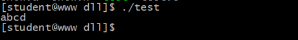
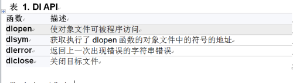
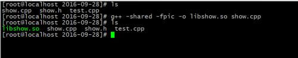

- [一、相关知识](#一相关知识)
- [二、静态库](#二静态库)
- [三、动态库的制作](#三动态库的制作)
- [四、动态加载](#四动态加载)
  - [4.1、用C实现](#41用c实现)
  - [4.2、用C++实现](#42用c实现)

## 一、相关知识

- 不管是制作静态库还是动态库，都得对.o文件进行打包；
- 在/lib64目录下，静态库文件.a，动态库文件 .so。

## 二、静态库

1. **gcc -c add.c** ---> 生成add.o文件，其中通过参数(**-c**)；
2. 静态库由命令ar创建；  **ar  -cr  add.a  add.o**
3. 静态库的编译有两种方法：
   - **gcc test.c -o test -L. add.a** //每次都得在编译时加上-L. 静态库文件；
   - 将.a文件(**此时的.a文件必须为lib开头的**)放到/lib64目录下面，此时就不加-L.参数了，但是运行时要加上静态库文件(-lxxxx)；

样例实现

第一步：打包成 .o文件

<div align=center></div>

第二步：创建.a文件

<div align=center></div>

第三步1：当前目录下通过-L. .a文件进行编译

<div align=center></div>

第四步1：运行结果

<div align=center></div>


第三步2：不在当前目录下面加-L. .a文件编译，此时就必须的改名为libshow.a；然后移到/lib64目录下面，在编译时加上参数：-lshow

<div align=center></div>


第四步2：运行结果

<div align=center></div>

</br>

以上就是静态库的制作了，按照规定流程走，最好都制作为**libxxxxx.a：**

1. **先生成.o文件；**
2. **打包成libxxxx.a文件；**
3. **此时2种编译途径，当前目录下利用-L. libxxx.a或-lxxxx进行编译；**
4. **只要编译成功，放之四海皆可执行--->因为利用静态函数库编译的文件比较大**

## 三、动态库的制作

.so：用在版本升级上有优势；核心参数：-shared -fpic

**gcc -shared -fpic -o libshow.so show.c    :-fpic->产生位置无关代码 -shared:->生成共享库**

样例实现：

第一步：实现创建libxxxx.so文件

<div align=center></div>

第二步：将libxxxx.so文件移动到/lib64下

<div align=center></div>

第三步：运行编译

<div align=center></div>

</br>

注意：

1. **动态库只有这一种编译运行的方式，必须将.so文件放到/lib64目录下，且文件名必须为libxxx.so；**
2. **静态库的libxxx.a文件不放，也可以编译运行成功；**

## 四、动态加载

在运行时才被加载到内存当中，效率相当的高；**编译时要在最后加一个选项：-ldl**

通过一系列的API完成：
<div align=center></div>

### 4.1、用C实现

第一步：先创建一个libxxx.so文件

<div align=center></div>

第二步：写加载的程序

test.c

```cpp
#include"show.h"
#include<dlfcn.h>

typedef void(*pFun)(char *);   //定义实现该方法的函数指针

int main(void){
    void *d1 = dlopen("libshow.so", RTLD_LAZY);  //打开这个动态库文件
    if(d1 == NULL){
        perror("dlopen");
        return -1; 
    }   

    pFun pfun = (pFun)dlsym(d1, "show");  //寻找名称为show的函数

    pfun("abcd");  //找到之后，函数指针在接着调用即可
    dlclose(d1);

    return 0;
}
```

第三步：直接进行编译运行，在最后加上参数：-ldl

<div align=center></div>

</br>

这样就实现了动态加载.so文件的方法；

### 4.2、用C++实现

(1)、第一步：创建一个libxxx.so文件

<div align=center></div>

(2)、第二步：移动到/lib64下

<div align=center></div>

(3)、第三步：编译运行

<div align=center></div>

</br>

此时发送了段错误；

分析：

1. **C语言找函数名称没有问题；**
2. **C++在动态链接库中找不到函数名字；因为C++具有重载，其函数名称早已经不是我们所看到的函数名称；**

**解决方案：**

1. **通过汇编，找其对应的函数名称；**
2. **extern "C" ,扩展C，用C的特性即可；**

改进的代码如下：

```cpp
show.h
#ifndef _SHOW_H_
#define _SHOW_H_

#include<stdio.h>
#include<iostream>
using namespace std;

extern "C" void show(char *str);  //扩展C,使其拥有C的性质(就将这个函数当做C语言解释)，函数名称就是我们所看到的，好找函数名称

#endif
////////////////////////////////////////////////////////////////////////////
show.cpp
#include"show.h"

extern "C" void show(char *str){
    cout<<str<<endl;
}
///////////////////////////////////////////////////////////////////////////////
test.cpp
#include"show.h"
#include<dlfcn.h>

typedef void(*pFun)(char *); 

int main(void){
    void *d1 = dlopen("libshow.so", RTLD_LAZY);
    if(d1 == NULL){
        perror("dlopen");
        return -1; 
    }   

    pFun pfun = (pFun)dlsym(d1, "show");

    pfun("abcd");
    dlclose(d1);

    return 0;
}
```

<div align=center></div>


<div align=center></div>
